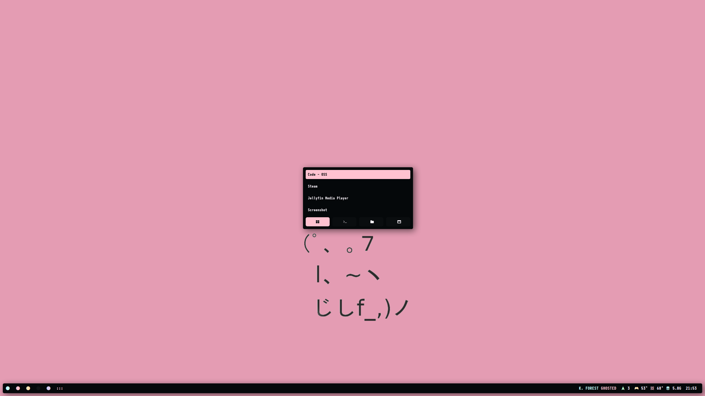

# SAGA for Rofi

A dark theme for [Rofi](https://github.com/davatorium/rofi).

 </br>

## Installation
1. ```git clone https://github.com/SAGAtheme/Rofi $XDG_CONFIG_HOME/rofi```
2. ```execute launcher.sh to spawn the menu(s)``` </br>

## Notes
- Inspiration from the work of [Siduck](https://github.com/siduck/). 
- Default font is [SAGA](https://github.com/SAGAtheme/sagafont). </br>
## License

[MIT License](./LICENSE)


